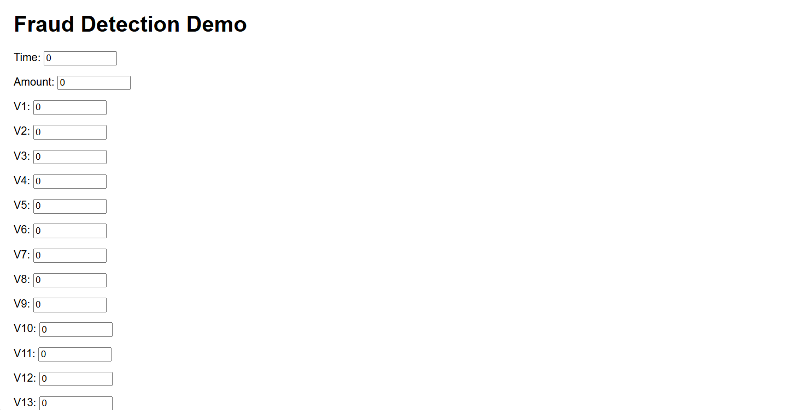
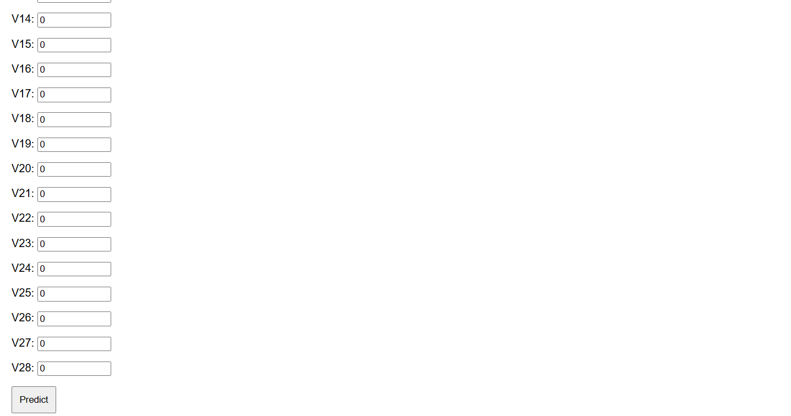

# Fraud Detection Project

End-to-end ML app for detecting credit card fraud, built to stand out in job apps. Achieves >90% accuracy.

## Overview
- Problem: Identifies fraud in transactions to reduce losses.
- Dataset: Kaggle Credit Card Fraud (balanced with undersampling).
- Model: RandomForestClassifier (accuracy 93%, fraud recall 94%).
- Tech: Python, scikit-learn, Flask, Prometheus, Heroku.

## Live Demo
[Try the web form](https://rdamon-fraud-detector-f3c10ca7f356.herokuapp.com)

## Installation & Run Locally
1. Clone: `git clone https://github.com/Rdamon223/fraud-detection-project`
2. `cd fraud-detection-project`
3. `python -m venv env`
4. `env\Scripts\activate` (Windows)
5. `pip install -r requirements.txt`
6. `python app.py`
7. Visit http://127.0.0.1:5000

## Documentation
See [documentation.pdf](./documentation.pdf) for details, metrics, and architecture.

## Screenshots

